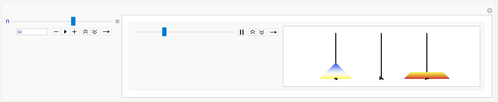

汉诺塔：又称河内塔, 是一个起源于印度的益智玩具。传说是梵天创世时, 做了三根金刚柱, 在第一根柱子上从下往上按大小顺序放上64片黄金圆盘, 梵天命婆罗门从圆盘下面开始按大小顺序重新摆放到第三根柱子上, 并规定, 小圆盘上不能放大圆盘, 三根柱子之间一次只能移动一个圆盘。随后, 僧侣们预言, 当所有金片从第一根转移到最后一根上时, 便是世界末日之时。  
汉诺塔的生成：
```mathematica
disck[color_, rob_, n_] := Table[Graphics[{colors[[color[[-i]]]], Rectangle[{(n) (rob - 2) - color[[-i]]/2, (i - 1)/2}, {(n) (rob - 2) + color[[-i]]/2, i/2}]}], {i, Length[color]}]
drawHanoi[state : {a_, b_, c_}] := Block[{n = Total[Length /@ state], rods, disks, colors, labels}, colors = ColorData["TemperatureMap"] /@ Range[0, 1, 1/n]; rods = Graphics[{Thick, Line[{{0, 0}, {0, n}}], Line[{{-n, 0}, {-n, n}}], Line[{{n, 0}, {n, n}}]}]; labels = Graphics[{Text[Style["a", 16, Bold], {-n, -1}], Text[Style["b", 16, Bold], {0, -1}], Text[Style["c", 16, Bold], {n, -1}]}]; disks = MapIndexed[disck[#1, #2 // First, n] &, state]; Show[rods, disks, labels, PlotRange -> {{-2 n, 2 n}, {-1.5, n + 1}}, Axes -> False]]
```
汉诺塔的可视化解法：
```mathematica
f[n_] := Flatten[Join[Table[{a -> b, a -> c, b -> a, b -> c}, {i, 1, n/2 - 1}], {a -> b,a -> c, b -> c}]] /; EvenQ[n] && Positive[n] == True
f[n_] := Flatten[Join[Table[{a -> b, a -> c, b -> a, b -> c}, {i, 1, (n - 1)/2}], {a -> c}]] /; OddQ[n] && Positive[n] == True
f[n_] := {a -> b, a -> c, b -> c} /; n == 2
f[n_] := {a -> c} /; n == 1
g[1, x_] := Flatten /@ {{x[[1, -1]]}, Drop[x[[1]], -1], x[[3]]}
g[2, x_] := Flatten /@ {{}, x[[2]], Join[x[[1]], x[[3]]]}
g[3, x_] := Flatten /@ {Drop[x[[2]], -1], {x[[2, -1]]}, {x[[3]]}}
g[4, x_] := Flatten /@ {{x[[1]]}, {}, {x[[2, -1]], x[[3]]}}
h[n_] := FoldList[g[#2, #1] &, {Range[n], {}, {}}, ToString /@ f[n] /. {"a -> b" -> 1, "a -> c" -> 2, "b -> a" -> 3, "b -> c" -> 4}]
Manipulate[ListAnimate[drawHanoi /@ h[n]], {n, 1, 100, 1}, LabelStyle -> Directive[Blue, Medium]]
```
运行示例：（n=62）

